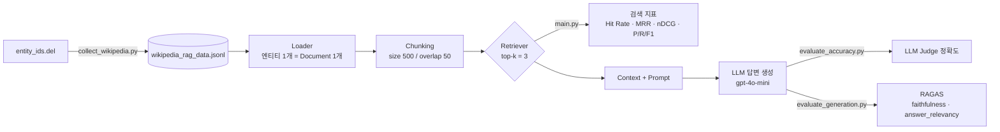

# RAG Retrieval & Generation Evaluation

Wikipedia 문서 약 1,000개를 코퍼스로 사용해 **RAG 파이프라인의 검색(Retrieval) 성능과 생성(Generation) 품질을 평가**하는 프로젝트입니다.
Dense(FAISS) · Sparse(TF-IDF, BM25) · Hybrid(Dense + BM25) 리트리버를 같은 조건에서 비교하고, 검색 결과를 바탕으로 생성한 답변의 정확도를 LLM-as-a-Judge와 RAGAS로 측정합니다.

<br>

## 주요 기능

- **데이터 수집**: Wikipedia API로 엔티티 문서(summary + 섹션)를 수집하며, 중단된 지점부터 이어서 수집할 수 있음
- **리트리버 비교**: Dense(Cosine / Euclidean), TF-IDF, BM25, Hybrid(RRF)
- **검색 평가**: Hit Rate@k, MRR, nDCG, Precision, Recall, F1
- **생성 평가**
  - 정답이 있는 short-answer 질문 400개에 대해 LLM Judge로 정확도 측정 (질문 유형별 집계)
  - RAGAS의 `faithfulness`, `answer_relevancy`
- **임베딩 캐시**: 같은 텍스트는 OpenAI 임베딩 API를 다시 호출하지 않고 재사용

<br>

## 파이프라인



<br>

## 프로젝트 구조

```
rag_retrieval_eval/
├── config.py                    # 경로, 모델, 청크/Top-k 등 전역 설정
├── main.py                      # 리트리버별 검색 성능 비교 (Cosine / Euclidean / Hybrid)
├── collect_wikipedia.py         # Wikipedia 엔티티 문서 수집 → jsonl
├── generate_eval_questions.py   # LLM으로 검색 평가용 질문(+keywords) 생성
├── evaluate_accuracy.py         # 정답셋 기반 답변 정확도 평가 (LLM-as-a-Judge)
├── evaluate_generation.py       # RAGAS 기반 생성 품질 평가
├── sweep_chunk_size.py          # PDF 코퍼스에서 chunk size별 리트리버 비교
├── requirements.txt
│
├── src/
│   ├── evaluation.py            # 검색 지표 계산
│   ├── retrieval/
│   │   ├── loader.py            # PDF / Wikipedia jsonl 로더
│   │   ├── chunking.py          # RecursiveCharacterTextSplitter 기반 청킹
│   │   ├── embedding.py         # OpenAI 임베딩 + 로컬 캐시
│   │   └── retrievers/
│   │       ├── dense.py         # FAISS (cosine / euclidean)
│   │       ├── tfidf.py         # TF-IDF + 코사인 유사도
│   │       ├── bm25.py          # BM25Okapi
│   │       └── hybrid.py        # Dense + BM25, RRF 결합 (EnsembleRetriever)
│   └── generation/
│       ├── context.py           # 검색된 청크 → 번호·출처가 붙은 컨텍스트
│       ├── prompt.py            # 컨텍스트 밖 지식 사용을 막는 프롬프트
│       └── generator.py         # LLM 답변 생성
│
├── evaluation_set/              # 정답이 있는 short-answer 질문셋 (jsonl, 총 400개)
└── data/
    ├── wikipedia/               # 엔티티 목록, 수집된 문서 (978개)
    ├── pdf/                     # PDF 코퍼스 (survey on RAG)
    ├── eval/                    # 평가셋 및 평가 결과 json
    └── embedding_cache/         # 임베딩 캐시 (git 제외)
```

<br>

## 시작하기

### 1. 설치

```bash
git clone https://github.com/Kjaemin339/RAG.git
cd RAG
pip install -r requirements.txt
```

### 2. 환경 변수

프로젝트 루트에 `.env` 파일을 만들고 OpenAI API 키를 넣습니다.

```env
OPENAI_API_KEY=sk-...
```

### 3. 실행

```bash
# (선택) Wikipedia 문서 수집: 이미 수집한 엔티티는 건너뜀
python collect_wikipedia.py

# (선택) 검색 평가용 질문 추가 생성
python generate_eval_questions.py

# 리트리버별 검색 성능 비교
python main.py

# 답변 정확도 평가 (LLM Judge) → data/eval/accuracy_results.json
python evaluate_accuracy.py

# RAGAS 생성 품질 평가 → data/eval/generation_results.json
python evaluate_generation.py

# PDF 코퍼스에서 chunk size(200/500/1000)별 Dense · TF-IDF · BM25 비교
python sweep_chunk_size.py
```

> `evaluate_accuracy.py`, `evaluate_generation.py` 상단의 `EVAL_LIMIT`로 평가할 질문 수를 제한할 수 있습니다. `None`이면 전체를 사용합니다.

<br>

## 설정

주요 하이퍼파라미터는 `config.py`에서 관리합니다.

| 항목 | 값 | 설명 |
|---|---|---|
| `EMBEDDING_MODEL` | `text-embedding-3-small` | Dense 검색용 임베딩 모델 |
| `GENERATION_MODEL` | `gpt-4o-mini` | 답변 생성 모델 |
| `JUDGE_MODEL` | `gpt-4o-mini` | 정확도 판정 모델 |
| `CHUNK_SIZE` / `CHUNK_OVERLAP` | 500 / 50 | 청크 크기, 겹치는 길이 (문자 기준) |
| `TOP_K` | 3 | 검색해 올 청크 수 |
| `WIKI_NUM_ENTITIES` | 1000 | 수집할 Wikipedia 엔티티 수 |

<br>

## 평가 방법

### 검색 평가 (`main.py`)

- **평가셋**: `data/eval/eval_set_wikipedia_en.json` (162문항, `question` / `entity` / `keywords`)
- **정답 판정**: 검색된 청크의 출처(`metadata["source"]`)가 질문의 `entity`와 같으면 관련 있는 청크로 봄
  - PDF 평가셋처럼 `entity`가 없는 경우에는 청크에 `keywords`가 포함됐는지로 판정

| 지표 | 의미 |
|---|---|
| Hit Rate@k | Top-k 안에 관련 청크가 하나라도 있는 질문의 비율 |
| MRR | 첫 번째 관련 청크 순위의 역수 평균 |
| nDCG | 관련 청크가 얼마나 상위에 배치됐는지 |
| Precision / Recall / F1 | Top-k 중 관련 청크 비율 / 전체 관련 청크 중 검색된 비율 / 두 값의 조화평균 |

### 생성 평가

- **정확도** (`evaluate_accuracy.py`): `evaluation_set/`의 400문항(`word` 123, `number` 164, `yes_no` 113)을 Hybrid 리트리버로 검색해 답변을 만들고, LLM Judge가 정답과 의미가 같은지 0/1로 판정
- **RAGAS** (`evaluate_generation.py`): `faithfulness`(답변이 컨텍스트에 근거하는지), `answer_relevancy`(답변이 질문과 관련 있는지)

<br>

## 결과

### 답변 정확도 (Hybrid, k=3, 400문항)

| 질문 유형 | 정확도 |
|---|---|
| number | 87.20% |
| word | 78.86% |
| yes_no | 64.60% |
| **전체** | **78.25%** |

### RAGAS (Hybrid, k=3, 10문항)

| Faithfulness | Answer Relevancy |
|---|---|
| 1.0000 | 0.9283 |

### 검색 성능 (k=3, 162문항, 문서 978개 → 청크 14,144개)

| Retriever | Hit Rate@3 | MRR | nDCG | Precision | Recall | F1 |
|---|---|---|---|---|---|---|
| Cosine | 97.53% | 0.9722 | 0.9696 | 0.8251 | 0.3969 | 0.4213 |
| Euclidean | 97.53% | 0.9722 | 0.9696 | 0.8251 | 0.3969 | 0.4213 |
| Hybrid | **98.77%** | **0.9815** | 0.9692 | 0.7593 | 0.3828 | 0.3975 |

> Recall이 낮은 것은 한 엔티티가 여러 청크로 쪼개지는데 k=3만 검색하기 때문입니다. 정답 엔티티의 청크를 전부 가져올 수 없으므로 Recall 상한 자체가 낮습니다.

<br>

## 기술 스택

- **Framework**: LangChain
- **Vector Store**: FAISS
- **Sparse Retrieval**: scikit-learn (TF-IDF), rank-bm25
- **LLM / Embedding**: OpenAI `gpt-4o-mini`, `text-embedding-3-small`
- **Evaluation**: RAGAS
- **Data**: Wikipedia-API, pypdf
